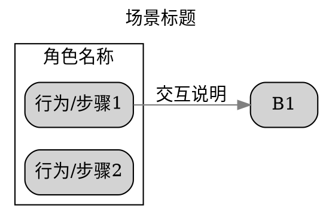
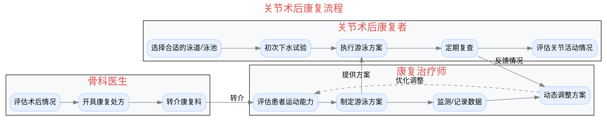
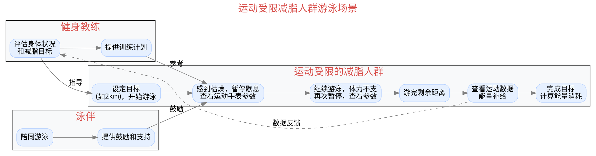

# 利益相关者地图

## 概述

利益相关者地图（Stakeholder Map）是一种可视化工具，用于展示产品生态系统中所有相关角色及其交互关系。

**重要原则**: 绘制**产品未介入**的原始场景，而非产品介入后的理想状态。这有助于识别真实痛点和介入机会。

## 绘制方法

### 使用Graphviz DOT语言

我们使用Graphviz的DOT语言绘制泳道图（Swimlane Diagram），清晰展示不同角色的行为流程和交互。

### 基本结构



## 完整案例1: 关节术后康复场景

### 场景描述
关节术后患者需要进行康复训练，涉及骨科医生、康复治疗师和患者本人的协作。

### 利益相关者地图



### 关键洞察
1. **断点**: 患者从医生处获得处方后，到康复治疗师处执行之间存在信息传递断点
2. **痛点**: 康复治疗师无法实时监测患者在泳池中的执行情况
3. **机会**: 数据记录和反馈循环主要依赖患者自述，缺乏客观测量

## 完整案例2: 运动受限减脂人群游泳场景

### 场景描述
运动受限的肥胖人群希望通过游泳减脂，但常因疲劳、枯燥等原因难以坚持。

### 利益相关者地图



### 关键洞察
1. **痛点**: 用户多次因疲劳/枯燥暂停，说明持续性是核心问题
2. **断点**: 教练的训练计划在执行过程中缺乏实时指导
3. **依赖**: 泳伴的鼓励是重要支持，但不总是可得
4. **机会**: 
   - 用户频繁查看参数，说明需要即时反馈
   - 数据反馈给教练是滞后的，缺乏实时调整机制

## 绘制步骤

### Step 1: 识别角色
列出所有与场景相关的角色：
- **主角色**: 直接使用产品/服务的核心用户
- **次要角色**: 影响决策或体验的其他利益相关者
- **外围角色**: 间接相关的角色

### Step 2: 映射行为流程
为每个角色列出典型行为序列：
- 使用动词+名词描述（如"查看参数"，"提供方案"）
- 标注决策点（选择、判断）
- 标注情感变化（枯燥、疲劳、满足）

### Step 3: 识别交互点
找出角色之间的交互：
- **信息流**: 谁向谁传递什么信息？
- **物品流**: 是否涉及物品交换？
- **情感流**: 是否有情感支持或影响？

### Step 4: 标注反馈循环
识别闭环流程：
- 数据收集 → 分析 → 调整 → 再收集
- 使用虚线箭头表示反馈

### Step 5: 可视化生成
使用Graphviz生成图表：

```bash
# 保存DOT代码到文件
cat > stakeholder_map.dot << 'EOF'
digraph {
    // 你的DOT代码
}
EOF

# 生成PNG图片
dot -Tpng stakeholder_map.dot -o stakeholder_map.png

# 生成SVG（推荐，矢量图）
dot -Tsvg stakeholder_map.dot -o stakeholder_map.svg
```

## 图表元素说明

### 节点样式
```dot
// 普通步骤
node [shape="box", style="filled,rounded", fillcolor="#e6f0ff"];

// 决策点（可选）
node [shape="diamond", fillcolor="#fff4e6"];

// 关键节点（可选）
node [style="filled,rounded,bold", fillcolor="#ffe6e6"];
```

### 连线样式
```dot
// 普通流程
A -> B;

// 反馈循环
A -> B [style=dashed, label="反馈"];

// 条件分支
A -> B [label="条件满足"];

// 避免影响布局
A -> B [constraint=false];
```

### 泳道样式
```dot
subgraph cluster_name {
    label = "角色名称";
    style = "filled";
    fillcolor = "#f8f9fa";  // 浅灰色背景
    
    // 该角色的所有节点
}
```

## 分析要点

### 1. 识别痛点
- **频繁暂停**: 表明流程中断问题
- **重复操作**: 可能存在效率提升机会
- **缺少连接**: 角色之间缺乏必要交互

### 2. 发现机会
- **信息断点**: 在哪里信息传递不畅？
- **等待时间**: 哪些步骤之间有时间间隔？
- **依赖缺失**: 哪些重要角色缺席或参与不足？

### 3. 验证假设
- 是否所有关键角色都已识别？
- 流程是否反映真实情况（而非理想状态）？
- 是否标注了关键决策点和情感变化？

## 常见错误

### ❌ 错误1: 画产品介入后的场景
```
错误示例：用户 -> 使用我们的App -> 完成训练
```
应该画：用户现在如何完成训练？遇到什么问题？

### ❌ 错误2: 只画主角色
很多产品的价值在于连接多个角色，忽略次要角色会遗漏重要洞察。

### ❌ 错误3: 流程过于简化
```
错误示例：用户 -> 游泳 -> 结束
```
应该细化：中间的暂停、查看数据、情绪变化等关键节点。

### ❌ 错误4: 缺少反馈循环
真实场景中往往有反复和迭代，一定要标注出来。

## 工具使用

### 在线Graphviz编辑器
- https://dreampuf.github.io/GraphvizOnline/
- https://edotor.net/

### 本地安装Graphviz
```bash
# macOS
brew install graphviz

# Ubuntu/Debian
sudo apt-get install graphviz

# Windows
# 下载安装包: https://graphviz.org/download/
```

### 集成到报告
生成的PNG或SVG可以直接嵌入HTML报告：
```html

```

## 检查清单

完成利益相关者地图后，检查：
- [ ] 是否画的是产品未介入的原始场景？
- [ ] 是否包含所有关键角色（主要和次要）？
- [ ] 每个角色是否有清晰的行为流程？
- [ ] 是否标注了角色间的关键交互？
- [ ] 是否识别了反馈循环？
- [ ] 是否标注了痛点和断点？
- [ ] 图表是否清晰易读（不过于复杂）？
